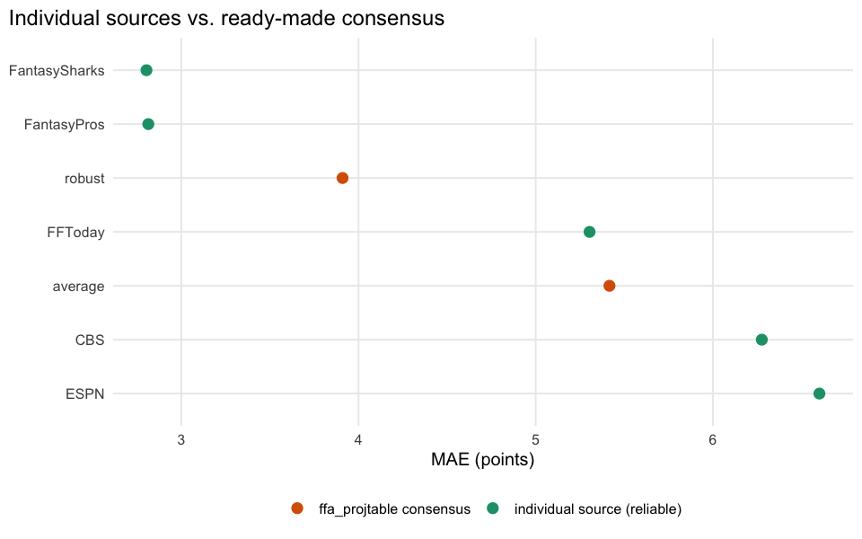
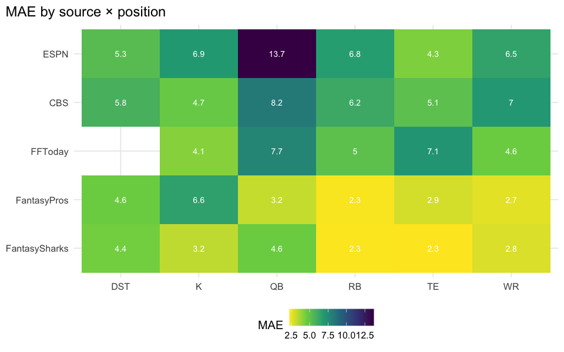
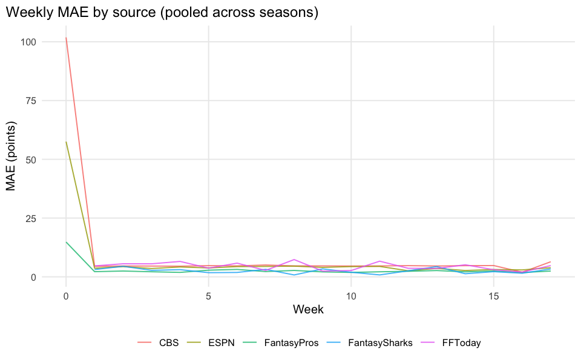
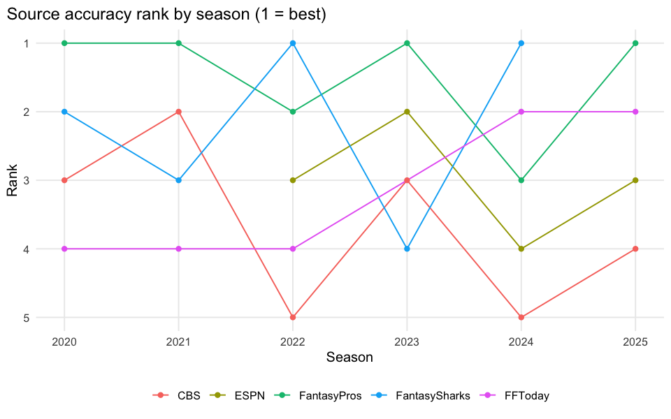

# Who Predicts Fantasy Football Best?

    source-accuracy bridge match rate: 25444 / 45975 = 55.3%

## Executive summary

Across 25444 source-level projections matched to real results, we rank
the 5 ffanalytics sources with enough matched observations (≥200) to
compare fairly by mean absolute error (MAE), check whether the best
source holds up by position and by season, and see whether the
ready-made consensus columns in `ffa_projtable` already beat the best
individual source. The other sources (Yahoo, NumberFire, FleaFlicker,
NFL, FanDuel, RTSports) only appear in one or two seasons with a handful
of matched rows each – shown in the appendix table for reference,
excluded from the headline ranking because their sample size makes any
rank noise, not signal.

## Does the best source change by position?

## Does accuracy change during the season?

## Is the best source stable across seasons?

## Do sources make the same mistakes?

This is where the data says something more interesting than a
correlation heatmap: among the 5 reliable sources, **0 player-weeks**
(of 25280) have more than one of them projecting the same game at the
same time. Coverage is fragmented by season instead (see the table
above) – CBS dominates most years, ESPN mostly 2022+,
FantasyPros/FantasySharks/FFToday thinner slices throughout – so there’s
no pair of sources with enough simultaneous coverage to compute a
meaningful residual correlation. Any claim about sources being
“independent” or “diverse” would be reading noise into a matrix built on
zero overlapping observations. See
[02-wisdom-of-crowd](02-wisdom-of-crowd.md) for what this means for
ensembling.

## Rankings (all sources, including thin-coverage ones)

| data_src      |     n |   mae |  rmse |   bias | reliable |
|:--------------|------:|------:|------:|-------:|:---------|
| FantasySharks |   268 |  2.80 |  4.52 |   1.14 | TRUE     |
| FantasyPros   |  2157 |  2.81 |  5.70 |   0.98 | TRUE     |
| FFToday       |   635 |  5.30 |  7.28 |   0.73 | TRUE     |
| CBS           | 19813 |  6.28 | 17.94 |   2.35 | TRUE     |
| ESPN          |  2407 |  6.60 | 18.71 |  -0.98 | TRUE     |
| Yahoo         |    84 |  1.63 |  3.53 |   1.15 | FALSE    |
| NumberFire    |    31 |  1.76 |  4.05 |   1.39 | FALSE    |
| FleaFlicker   |    18 |  2.75 |  3.97 |   0.37 | FALSE    |
| NFL           |    16 |  7.47 | 14.91 |   6.05 | FALSE    |
| FanDuel       |    12 | 10.66 | 16.44 |   5.43 | FALSE    |
| RTSports      |     3 | 17.70 | 19.42 | -17.70 | FALSE    |

**Takeaway:** among sources with reliable sample sizes, CBS and ESPN
carry almost all of the matched observations and sit mid-pack on MAE;
FantasyPros and FantasySharks are competitive on far fewer projections.
The near-zero overlap between sources (previous section) means “ensemble
of individual sources” isn’t really testable in this dataset — see
[02-wisdom-of-crowd](02-wisdom-of-crowd.md) for what *is* testable.
