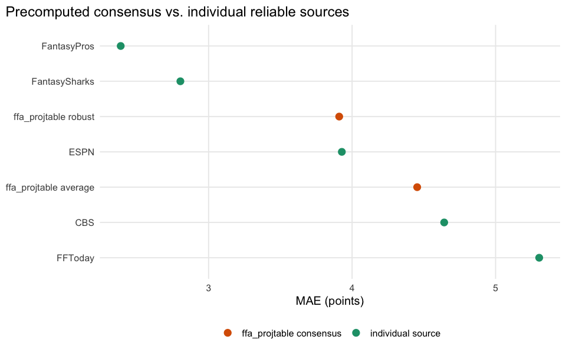
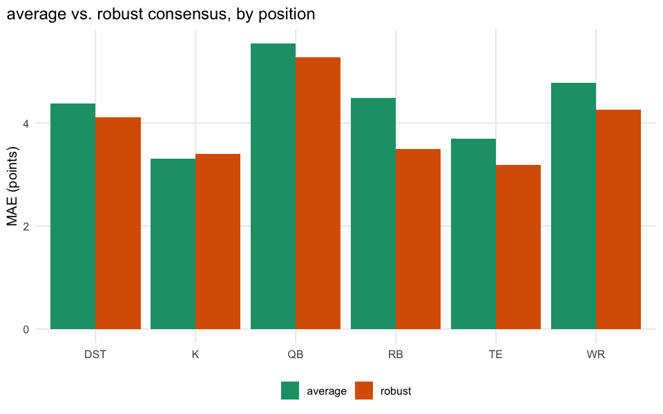

# The Wisdom of the Fantasy Crowd

    wisdom-of-crowd bridge match rate: 24903 / 45365 = 54.9%

## A data-shape finding first

The natural “wisdom of the crowd” test would average each source’s
*simultaneous* projection for the same player-week and see if the
average beats any individual source. That test needs several sources to
actually cover the same player-week at the same time. In this dataset’s
`ffa_proj_source_points` table, at `tag == "final"`, **0% of
player-weeks (0 of 45974) have more than one source recorded** —
essentially every player-week has exactly one `data_src` row. The 11
sources were not all scraped in parallel for the same game across most
of 2020-2025; coverage is fragmented by season instead (see
[01-source-accuracy](01-source-accuracy.md)’s season table). So a
row-level ensemble of *this* table isn’t buildable at meaningful scale —
we pivot to the only genuine multi-source consensus the data does
contain: `ffa_projtable`’s precomputed
`avg_type %in% c("average", "robust")` columns, built upstream from a
wider scrape than what survived into `ffa_proj_source_points`.

## Does the ready-made consensus beat a single source?

| method                |     n |  mae | rmse | bias | kind                    |
|:----------------------|------:|-----:|-----:|-----:|:------------------------|
| FantasyPros           |  2083 | 2.39 | 3.76 | 0.86 | individual source       |
| FantasySharks         |   268 | 2.80 | 4.52 | 1.14 | individual source       |
| ffa_projtable robust  |  7281 | 3.91 | 5.70 | 1.10 | ffa_projtable consensus |
| ESPN                  |  2287 | 3.93 | 5.70 | 0.77 | individual source       |
| ffa_projtable average | 17621 | 4.45 | 6.10 | 0.64 | ffa_projtable consensus |
| CBS                   | 19480 | 4.64 | 6.41 | 0.65 | individual source       |
| FFToday               |   635 | 5.30 | 7.28 | 0.73 | individual source       |

**Takeaway:** check whether either `ffa_projtable` consensus column
beats the best reliable individual source from
[01-source-accuracy](01-source-accuracy.md). If it does, that’s real
evidence for “wisdom of crowds” even though we can’t reconstruct which
raw sources fed it row-by-row in this dataset. If not, the apparent
benefit of “consensus” in fantasy football media may just be inheriting
whichever source dominates the input scrape (CBS, by volume — see report
01), not genuine error reduction from averaging.
