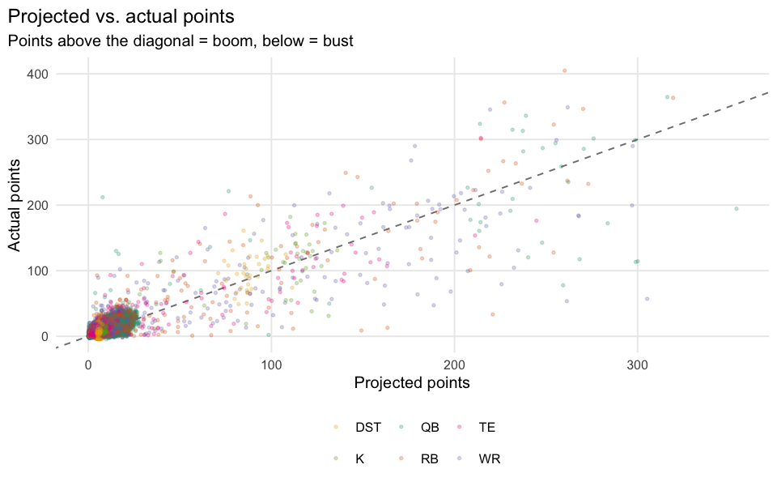
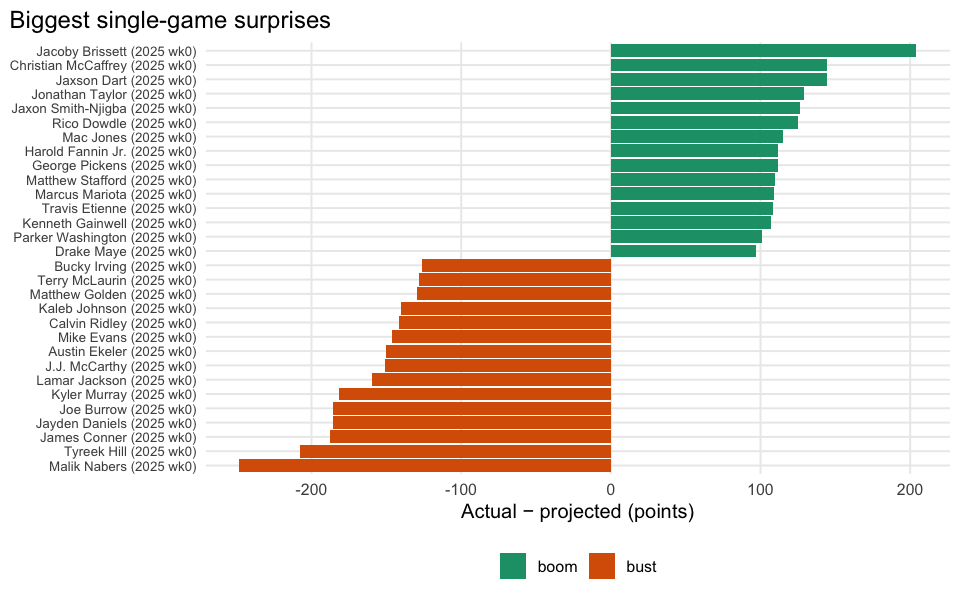
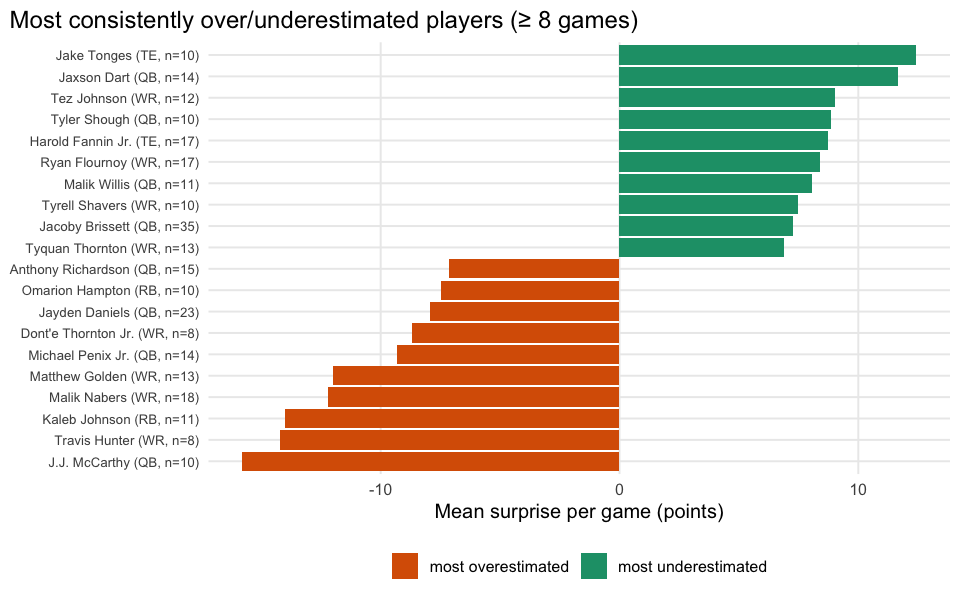

# Booms, Busts and Surprises

    booms-busts bridge match rate: 18162 / 27486 = 66.1%

## Executive summary

`surprise = actual points - projected points` (consensus
`avg_type == "average"` from `ffa_projtable`). Positive surprise is a
boom, negative is a bust. We look at the biggest single-game surprises
and at which players are *consistently* over- or under-projected across
many games, not just a lucky or unlucky week.

## Who’s consistently mis-projected?

**Takeaway:** a player who’s above the diagonal every week isn’t having
a hot streak — projections are systematically light on them. That’s a
standing edge for anyone drafting or trading on gut feel over the
projection, at least against this projection source.
