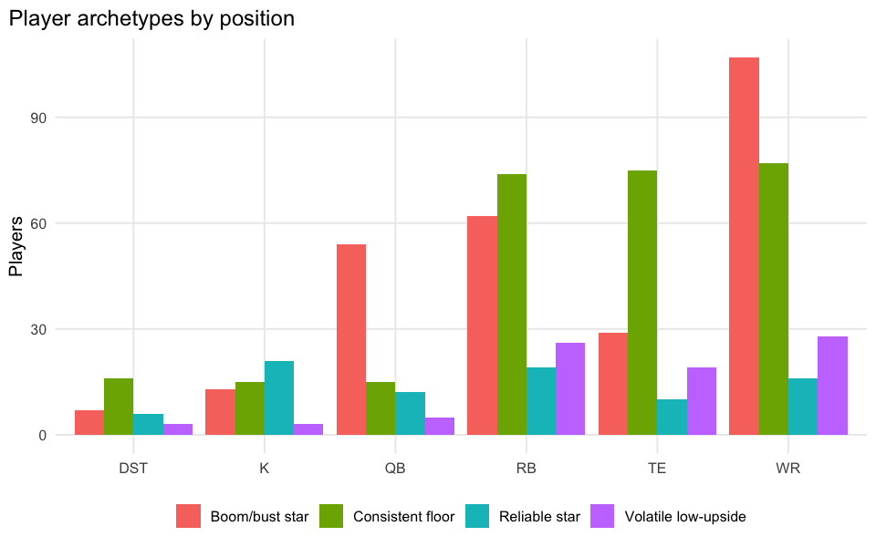
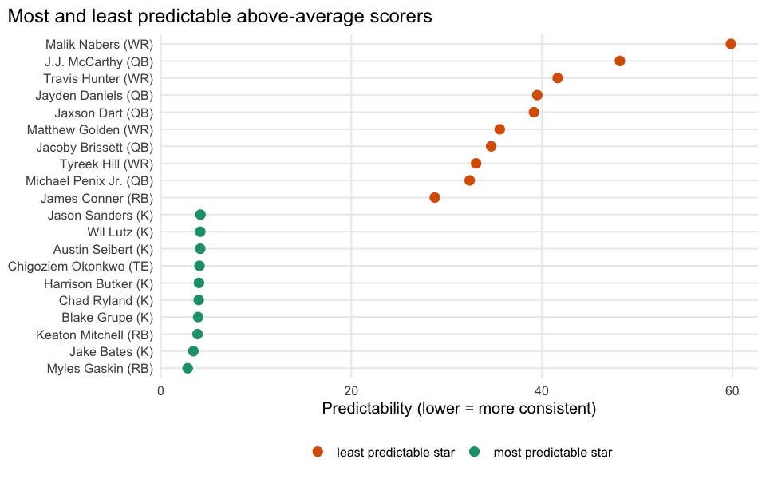

# Who Is Actually Predictable?

    predictability bridge match rate: 18162 / 27486 = 66.1%

## Executive summary

Instead of “who scores the most,” we ask “who do we actually know how to
project?” `predictability = SD(actual - projected)` per player (lower =
more predictable), computed only for players with at least 6 matched
games. Plotting average points against predictability separates four
archetypes: reliable stars, boom/bust stars, low-upside-but-steady
players, and low-upside-and-volatile players.

**Takeaway:** the top-left quadrant (reliable stars) is who you draft
early with confidence; the top-right (boom/bust stars) is who wins or
loses your week depending on variance, not skill at projecting them.
