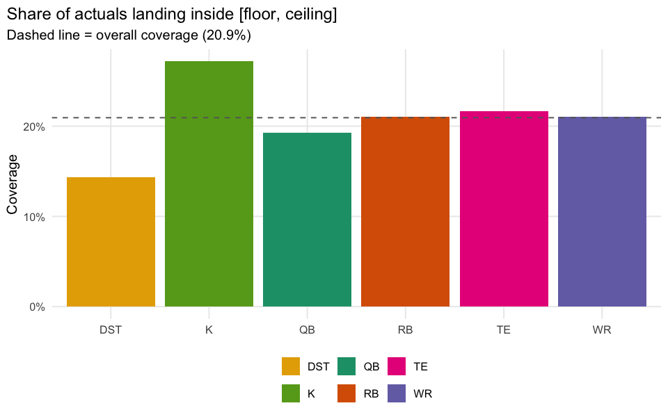

# Does Projection Uncertainty Mean Anything?

    uncertainty-calibration bridge match rate (incl. sd_pts/floor/ceiling non-NA): 17501 / 26876 = 65.1%

## Executive summary

`ffa_projtable` carries `sd_pts`, `floor` and `ceiling` alongside every
projection. If those numbers mean anything, “high uncertainty” players
should actually show larger errors, and `actual` should land inside
`[floor, ceiling]` a stable, sensible share of the time.
`floor`/`ceiling` aren’t documented anywhere as a fixed nominal interval
(e.g. not stated to be an 80% or 95% band), so this report reports the
*observed* coverage rather than testing against an assumed target.

## Interval coverage

| uncertainty |  coverage |    n |
|:------------|----------:|-----:|
| low         | 0.1540967 | 5834 |
| medium      | 0.2106616 | 5834 |
| high        | 0.2633293 | 5833 |

**Takeaway:** if MAE climbs cleanly from the low to the high `sd_pts`
tercile, the model’s self-reported uncertainty is doing real work, not
just decoration. If coverage is roughly flat across positions and
tercile groups, `floor`/`ceiling` behaves like a consistent interval
rather than one that’s only calibrated for some positions.
