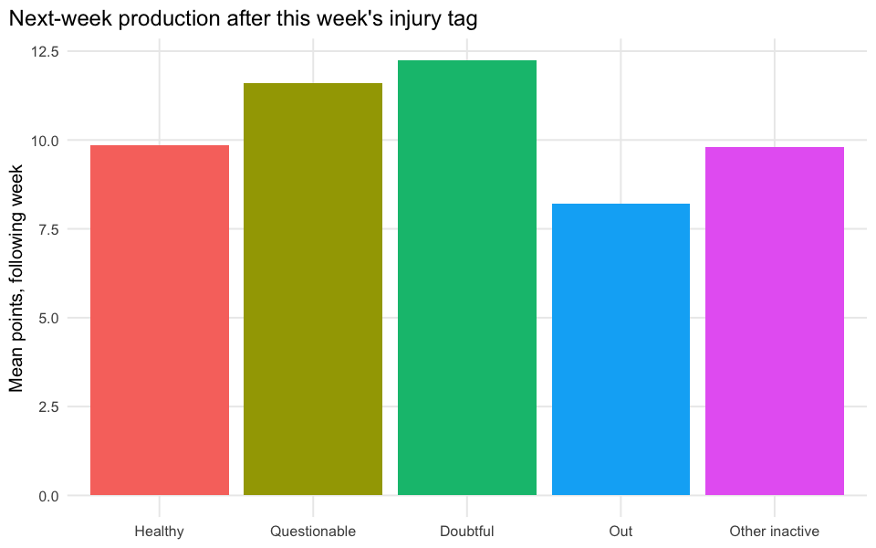

# The Cost of a Questionable Tag

## Executive summary

`nfl_player_injury_status` only carries a `playerId` + weekly snapshot
`timestamp`, no `season`/`week` – we derive those by
nearest-preceding-week lookup against `ffa_projtable`’s own timestamp
calendar (see `assign_week()` in `R/_common.R`); treat week assignment
as approximate, not the official schedule. `injuryGameStatus` has 12 raw
levels; we bucket them into Healthy (no note) / Questionable / Doubtful
/ Out / Other inactive (IR, PUP, suspended, etc.). We compare same-week
projected vs. actual points by bucket, and check whether the projection
already discounts questionable players before the game is played.

    injury-status to projection/actual match rate: 15941 / 69168 = 23.0%

## Do projections already discount questionable players?

| status         |     n | mean_projected | mean_actual | pct_of_healthy_projection |
|:---------------|------:|---------------:|------------:|--------------------------:|
| Healthy        | 14429 |          8.481 |       9.198 |                     1.000 |
| Questionable   |   988 |         10.155 |       9.859 |                     1.197 |
| Doubtful       |    32 |         11.589 |      10.494 |                     1.366 |
| Out            |    93 |          9.927 |       7.466 |                     1.170 |
| Other inactive |   399 |          8.648 |       9.012 |                     1.020 |

**Takeaway:** if `pct_of_healthy_projection` drops well below 1.0 for
Questionable/Doubtful, the projection pipeline is already pricing in the
injury note before kickoff. If `mean_actual` still falls far short of
even that discounted projection, the market isn’t discounting enough.
Watch for a selection-bias trap here, though: “Healthy” absorbs every
player who simply never got a status note logged, including irrelevant
bench/waiver players with low baseline points – so a *higher* mean for
Questionable than Healthy more likely means “only notable, heavily-used
players get injury notes at all” than “questionable players outscore
healthy ones.” Comparing status buckets within the same player (their
own healthy-week average vs. their questionable-week average) would
remove this confound; this report doesn’t do that decomposition.
