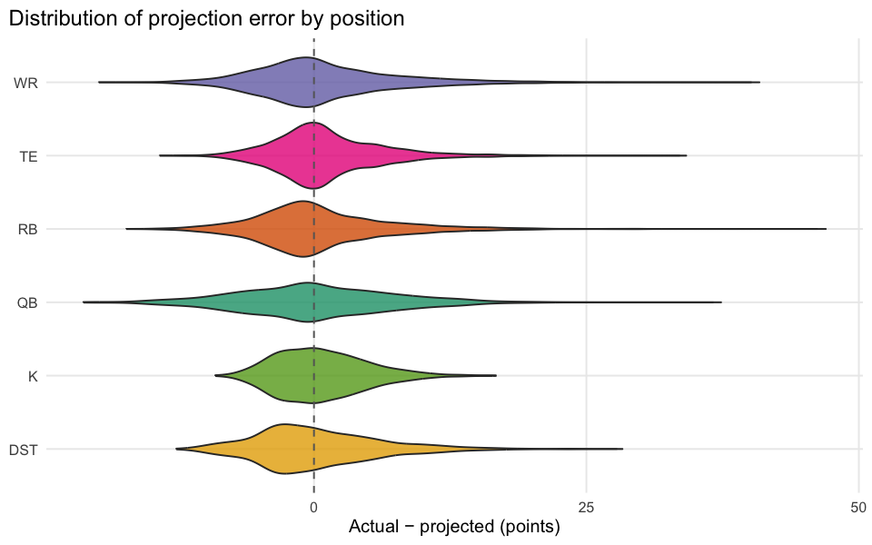
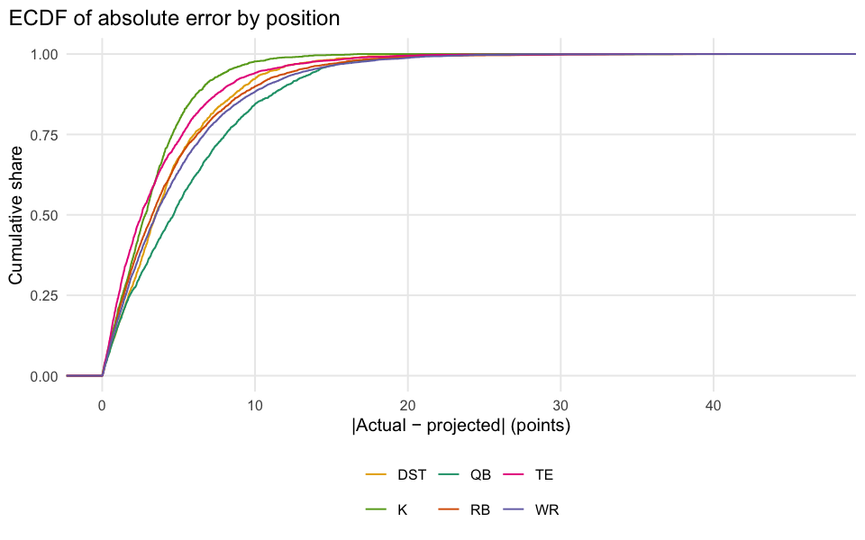

# Which Position Is Hardest to Predict?

    error-by-position bridge match rate: 17621 / 26876 = 65.6%

## Executive summary

Using the same `ffa_projtable` consensus (`avg_type == "average"`) vs.
actual points as [03-booms-busts](03-booms-busts.md), we break the error
down by position to see which one the projection model consistently
struggles with most.

| pos |    n |  mae | rmse | bias |
|:----|-----:|-----:|-----:|-----:|
| QB  | 2081 | 5.55 | 7.18 | 0.08 |
| WR  | 5309 | 4.78 | 6.54 | 0.77 |
| RB  | 4217 | 4.48 | 6.24 | 0.47 |
| DST | 1483 | 4.38 | 5.71 | 0.27 |
| TE  | 2958 | 3.70 | 5.24 | 1.18 |
| K   | 1573 | 3.30 | 4.21 | 0.69 |

**Takeaway:** high-usage skill positions with more scoring pathways
(receiving + rushing, or big-play upside) tend to have both higher
average points and higher absolute error – the ranking above shows
whether that scales roughly with scoring volume or whether one position
is disproportionately hard to call relative to how many points is at
stake.
