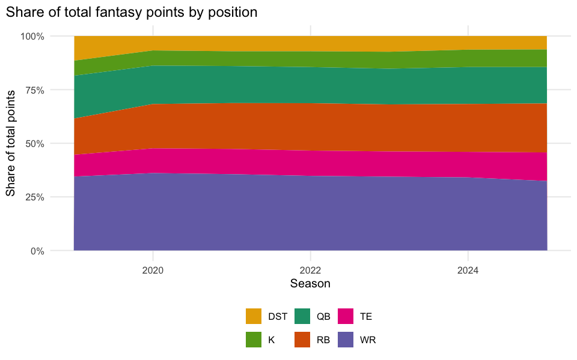
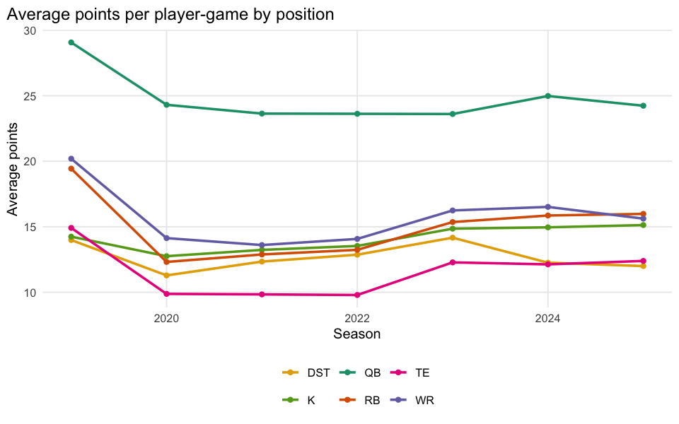

# The Shifting Shape of Fantasy Scoring

    positional-evolution player-metadata match rate: 42446 / 42446 = 100.0%

## Executive summary

Average fantasy production by position, season and week, 2020-2025 (this
dataset’s coverage – not back to 2019). We look at whether RBs have lost
ground to WRs and whether scoring has concentrated in fewer positions or
spread out.

**Takeaway:** a rising WR-minus-RB gap over the seasons is data-level
confirmation of the “Zero RB” drafting theory; a flat or shrinking gap
would argue against it for this league’s scoring settings.
