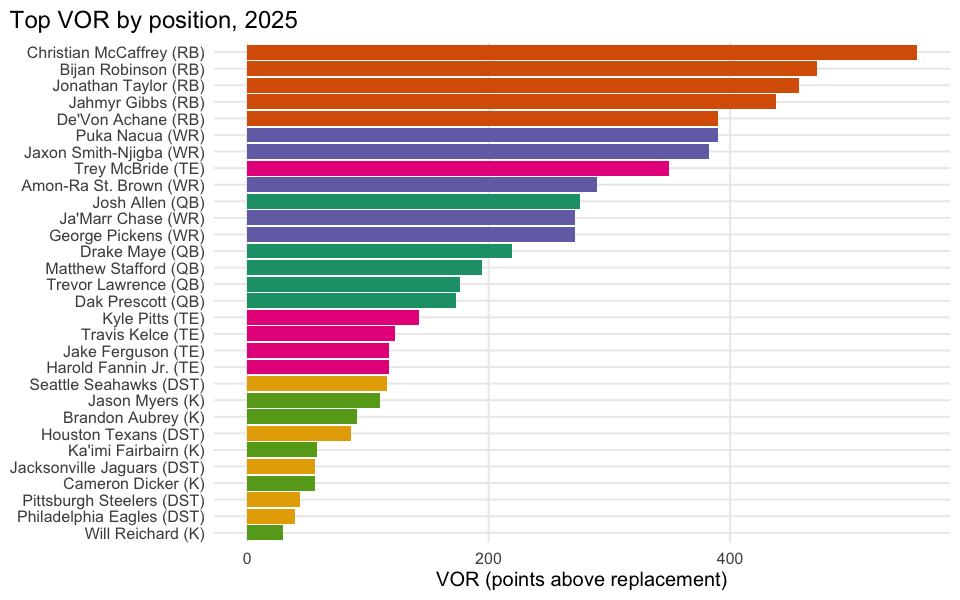

# Stars, Starters and Replacement Players

## Executive summary

This computes VOR **empirically** from actual season point totals, not
from `ffa_projtable$points_vor` – that column is 100% NA for 2020-2023
and only appears in 2024-2025, so it can’t support a full-history VOR
story. Replacement rank per position (QB14/RB35/WR40/TE14, K/DST
extended to 14) is a fixed convention from the source brief, **not**
derived from this league’s actual starter demand:
`nfl_teams_rosters$slotPosition` only has 3 coarse buckets
(`O`/`DT`/`K`), too coarse to reconstruct real per-position starter
counts, so this is a documented simplification, not a league-exact
number.

**Takeaway:** the steepness of the scarcity curve right up to the
replacement-rank line is “positional scarcity” made visible – a position
whose curve drops fast even at low ranks creates more competitive
advantage per roster spot than one with a long, flat tail of replaceable
production.
