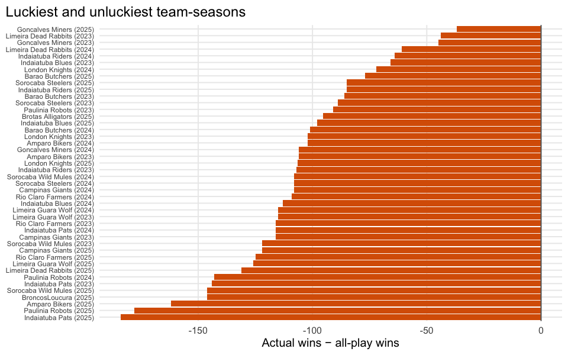

# Was Your Team Good, or Just Lucky?

    schedule-luck season coverage (expect 3: 2023-2025): 3 / 3 = 100.0%

## Executive summary

`nfl_teams_week_stats` only has a finalized (`tag == "final"`) actual
score per team-week for 2023-2025; 2020-2022 only exists as a preview
snapshot, so this report is scoped to 2023-2025. For every team-week we
compute the “all-play” record – how many of the other teams that team
would have beaten with that same score – and compare season-total
all-play wins to actual wins.

**Takeaway:** a team well above the diagonal won more than its weekly
scores deserved – schedule luck, not roster strength. That’s the team to
regress toward the mean next season; the team below the diagonal is the
buy-low candidate.
