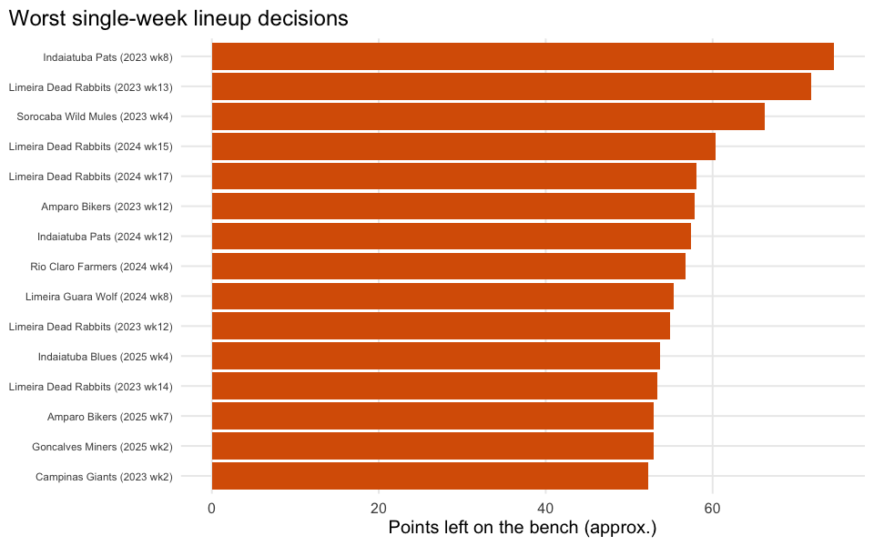

# The Manager Effect

    roster-to-actual-points match rate: 9206 / 11232 = 82.0%

## Executive summary

`actual` = sum of points scored by a team’s starters
(`rosterSlotId %in% STARTER_SLOTS`, 7 lineup slots/week). `possible` =
sum of the top-K point scorers among that team’s **entire** roster that
week (K = number of starter slots), ignoring exact position-eligibility
(QB/RB/WR/TE/FLEX/K/DST). This is a **documented simplification**, not a
real lineup optimizer – `nfl_teams_rosters$slotPosition` only has 3
coarse buckets (`O`/`DT`/`K`), too coarse to reconstruct which bench
player was actually eligible to start at which slot, so `possible` is a
modest overestimate of what a manager could really have started.
`efficiency = actual / possible` is still a useful relative ranking
across managers even though its absolute level isn’t exact.

**Takeaway:** treat `efficiency` as a relative ranking, not an exact
percentage – the top managers are consistently starting their
highest-scoring roster spots, while the bottom of the list is where
lineup-setting discipline (or waiver-wire activity) is actually costing
wins.
