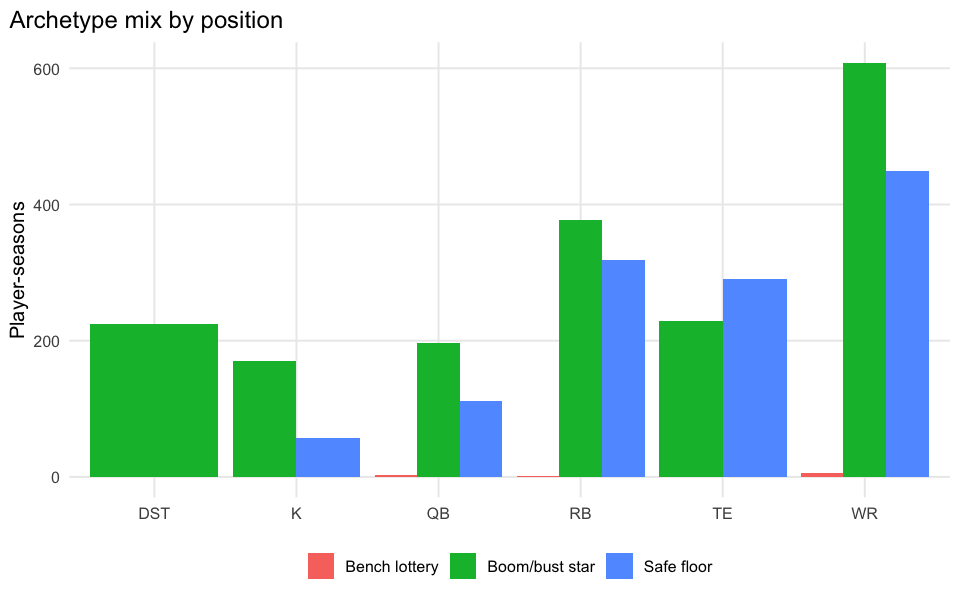

# A Fantasy Football Periodic Table

    periodic-table eligible player-seasons (>= min games): 3041 / 4134 = 73.6%

## Executive summary

Per-player-season features: production (mean points), volatility (SD of
points), CV (volatility / production) and availability (games played),
restricted to players with at least 6 games. `kmeans()` (base R, scaled
features) groups players into archetypes, which we label after the fact
from each cluster’s centroid – the labels are descriptive, not
categories that exist in the source data.

| cluster | production |        cv |     games |    n |
|:--------|-----------:|----------:|----------:|-----:|
| 5       | 30.0273336 | 1.8501901 | 15.226772 |  635 |
| 2       | 13.1939249 | 1.9007701 | 15.268606 | 1169 |
| 1       |  8.7117128 | 1.3860094 |  8.632338 |  971 |
| 3       |  7.7590562 | 0.6766219 | 11.843750 |  256 |
| 4       | -0.0382745 | 6.2171015 | 11.100000 |   10 |

**Takeaway:** “Reliable star” is who you draft to win your league with
the least stress; “Boom/bust star” wins or loses your week for you;
“Bench lottery” is where late-round upside picks live.
