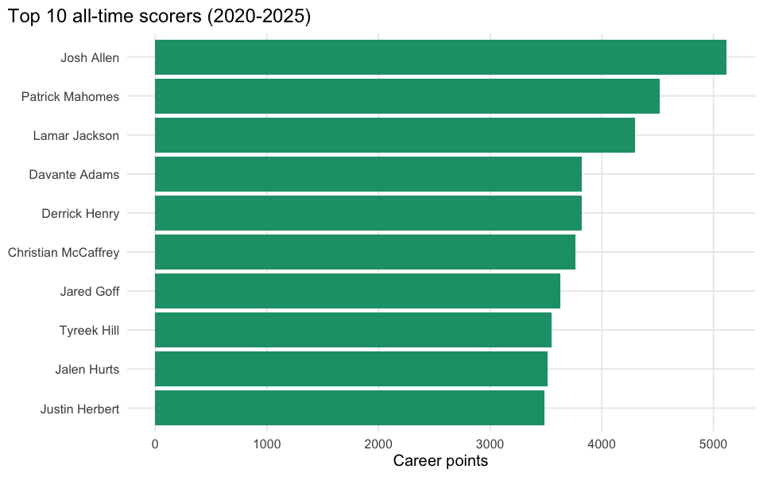

# Career Fingerprints

## Executive summary

Weekly fantasy points for the top 10 all-time scorers in this dataset’s
coverage (2020-2025, not back to 2019). Color intensity = points; gaps =
bye weeks, injuries or seasons not played.

**Takeaway:** a consistently bright row is a durable, healthy star; a
row with a dark gap mid-career marks an injury or decline that’s easy to
miss in a season-average stat line but obvious here.
