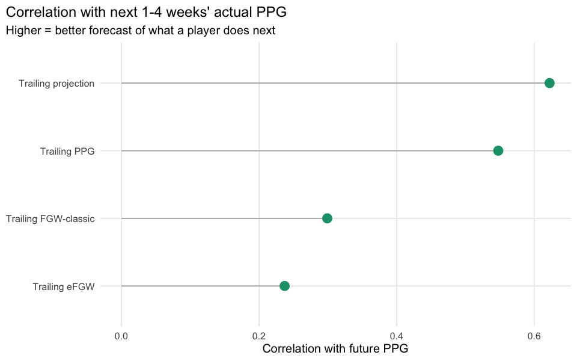

# Does FGW Persist?

    starter-week-to-projection match rate (for the trailing-projection baseline): 4743 / 6313 = 75.1%

## Executive summary

`fgw_analysis.md` section (Experiment 2) asks a narrower question than
[15-fgw-metrics](15-fgw-metrics.md): not “does FGW describe what already
happened,” but **“does a player’s FGW through week *N* predict their
production in weeks *N+1..N+4* better than trailing points-per-game, or
the projection itself?”** If it doesn’t, FGW/eFGW are retrospective-only
tools – genuinely useful for 15’s attribution question, but not a
forecasting signal. We test this the same way
[04-predictability](04-predictability.md) frames reliability: rolling
trailing windows within each of the 3 seasons, requiring at least 3
prior starts and comparing against at least 1 of the next 4 weeks.

Each row is one (player, season, cutoff week) observation: a trailing
feature computed only from weeks up to the cutoff, and a future outcome
computed only from weeks strictly after it – no look-ahead. 3870 such
observations across 286 starters and the 3 seasons.

| predictor            | corr_with_future |
|:---------------------|-----------------:|
| Trailing projection  |            0.622 |
| Trailing PPG         |            0.548 |
| Trailing FGW-classic |            0.299 |
| Trailing eFGW        |            0.237 |

**Takeaway:** trailing projection and trailing PPG both predict a
player’s next few weeks meaningfully better than trailing FGW-classic or
eFGW do. That’s the expected result, not a disappointing one –
`fgw_analysis.md` itself (sections 8 and 19) frames FGW as a
retrospective attribution metric, not a forecasting one: it deliberately
compresses a player’s raw production through their team’s
win-probability curve, which discards exactly the kind of information
(this player is simply good/healthy/featured) that carries forward week
to week. FGW answers “how much did this performance matter,” not “what
will this player do next” – for the latter, keep using the projection.
This also means a decision rule built by summing *past* FGW would be a
weaker predictor than one built from projected points –
[17-fgw-decision-backtest](17-fgw-decision-backtest.md) uses projections
(xFGW), not trailing FGW, for exactly this reason.
