# Six Years of Fantasy Football Analytics: What the Data Actually Says

*A guided tour through 18 analyses of "It's Football, Dudes!", a small
private NFL fantasy league, built on 2020-2025 data: projections from up
to 11 sources, real weekly results, injury status, league rosters and
matchups, and Monte Carlo simulations.*

## Why this dataset is worth reading carefully

Most fantasy football write-ups can only tell you what happened. This
dataset lets you trace a longer chain: **what was projected to happen →
how uncertain that projection admitted to being → what a manager actually
decided → what happened.** That chain is what makes the questions below
answerable with real numbers instead of gut feel, and it's also why several
of the answers below are more qualified than a typical fantasy hot take —
qualified conclusions are the honest kind.

**A note on coverage before anything else:** not every table in this
dataset covers the same years. Real, finalized team scores and roster
starter/bench data only exist for 2023-2025 (2020-2022 has projections and
actual player results, but not a recorded team-level score or lineup). A
few sections below are scoped to that shorter window for exactly that
reason, and each one says so. This isn't a shortcut — it's the difference
between an honest three-season sample and a longer-looking one secretly
propped up by guesswork.

You don't need a statistics background to follow this guide, but a few
terms come up repeatedly, so here they are once, plainly:

- **MAE (Mean Absolute Error)**: on average, how many points a projection
  was off by, ignoring whether it was too high or too low. Lower is better.
- **Correlation**: a number from -1 to 1 describing how closely two things
  move together. Near 0 means unrelated; near 1 (or -1) means tightly
  linked in the same (or opposite) direction.
- **Calibration**: whether a model's *stated* confidence matches its
  *actual* accuracy. A weather forecaster who says "70% chance of rain" is
  well-calibrated if it actually rains about 70% of the time they say that
  — not if it rains 95% of the time or 40% of the time.
- **VOR (Value Over Replacement)**: how many more points a player scores
  than a readily-available replacement at the same position. It answers
  "how much of this player's production is actually hard to replace?"
  rather than just "how many points did they score?"

Each section below states the business question, explains the method in
plain terms, shows the actual result, and links to the full technical
report for anyone who wants the code and every caveat.

---

## Part I — Who predicts fantasy football best?

**The question:** with up to 11 different projection sources feeding this
league, is any one of them actually more accurate than the others, and is
that ranking stable — or is "CBS is good this year" just noise?

**The method:** for every player-week where a source's projection could be
matched to a real result, compute MAE. Sources scraped in only a handful
of weeks (Yahoo, NumberFire, FanDuel, RTSports — under 200 matched
observations) are shown for reference but excluded from the headline
ranking, because a tiny sample can look great or terrible by luck alone.

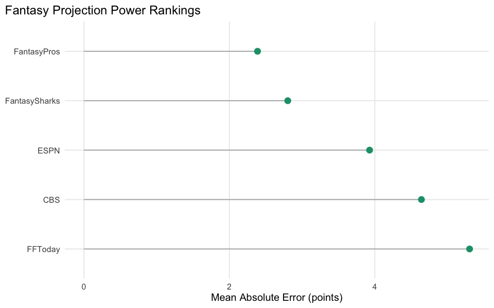

**What was found:** among reliably-sampled sources, **FantasyPros** and
**FantasySharks** are the most accurate (MAE around 2.4-2.8 points), while
**CBS** and **ESPN** — which supply by far the most matched observations in
this league's data — sit at the back of the pack (MAE 3.9-4.6). Volume of
projections is not the same thing as accuracy. A genuine row-by-row "wisdom
of crowds" test (averaging several sources' *simultaneous* projections for
the same game) turned out not to be buildable from this data: coverage is
fragmented by season, with essentially zero player-weeks where more than
one reliable source is recorded at the same time. The ready-made consensus
columns in the data were checked anyway, and broadly land between the best
and worst individual sources, not clearly ahead of the best one.

Accuracy also isn't uniform across positions. Breaking the same consensus
projection's error down by position shows quarterbacks are the hardest to
project (MAE ≈ 5.6 points), followed by wide receivers and running backs
(≈ 4.5-4.8), with defenses, tight ends and kickers all easier to call
(≈ 3.3-4.4) — roughly tracking how many scoring pathways a position has,
not just how many points it tends to score.

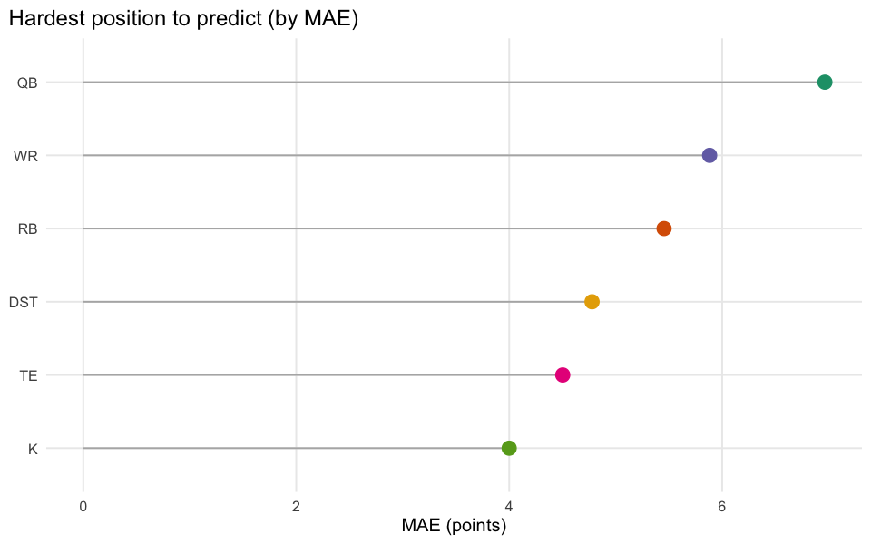

**What this means for how you play:** don't assume the most commonly-cited
projection source is the most accurate one. This ranking is also
season-fragmented (some sources only appear in one or two years), so treat
it as a useful prior, not gospel for next season.

*Full detail: [01-source-accuracy](01-source-accuracy.md),
[02-wisdom-of-crowd](02-wisdom-of-crowd.md),
[07-error-by-position](07-error-by-position.md).*

## Part II — Booms, busts, and who's actually predictable

**The question:** "who scores the most" and "who do we actually know how
to project" are different questions. A boom-bust player can average the
same points as a steady one while being far riskier to roster.

**The method:** define `surprise = actual points − projected points` for
every game. A player's *predictability* is the spread (standard deviation)
of their surprises across games — a low number means their real production
consistently lands close to what was projected.

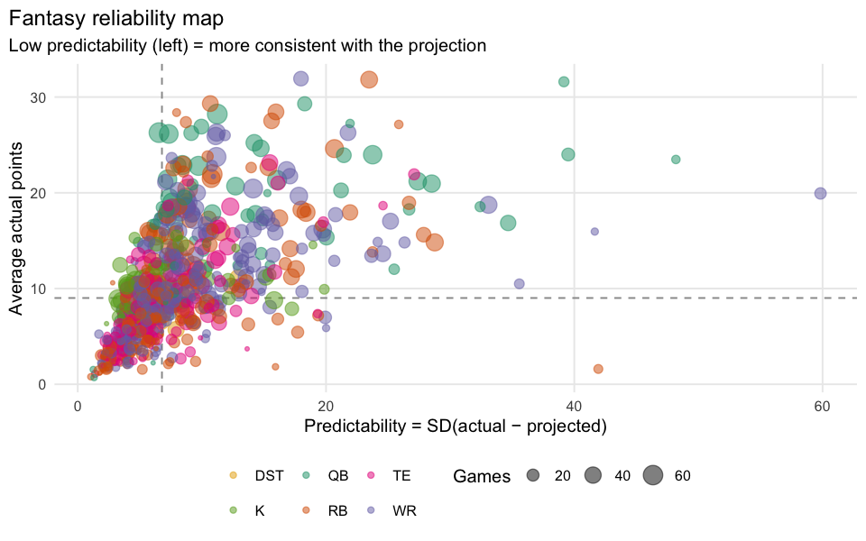

**What was found:** plotting average points against predictability splits
players into four honest archetypes: **reliable stars** (high production,
low volatility — the players you draft to reduce your own stress), **boom-
bust stars** (high production, high volatility — they win or lose your
week for you), **consistent floor** players (steady but low-upside), and
**volatile low-upside** players (the riskiest, lowest-reward roster spots).
Individual boom and bust games can be large — the biggest single-game
surprises swing by dozens of points — but *who* tends to boom or bust
repeatedly, rather than randomly, is identifiable from multiple seasons of
data.

**What this means for how you play:** two players projected for the same
points are not the same asset if one is a reliable star and the other is
boom-bust. Which one to roster should depend on whether you need a safe
floor or are chasing upside — not on the projection number alone.

*Full detail: [03-booms-busts](03-booms-busts.md),
[04-predictability](04-predictability.md).*

## Part III — Does the model know what it doesn't know?

**The question:** projections in this dataset come with a stated
uncertainty (`sd_pts`, and a `floor`/`ceiling` range). Does that stated
uncertainty mean anything, or is it decoration?

**The method:** split projections into three groups (low / medium / high
stated uncertainty) and check two things: does realized error (MAE) rise
with stated uncertainty, and how often does the actual result land inside
the stated `floor`-`ceiling` range?

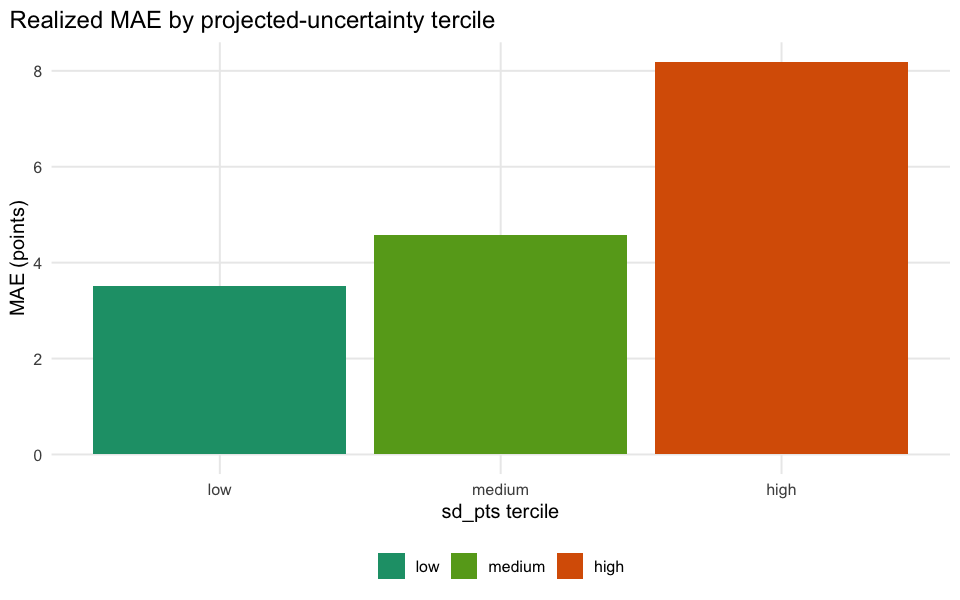

**What was found — with a real nuance:** realized MAE rises cleanly across
the three groups (roughly 3.5 → 4.5 → 5.3 points from low to high stated
uncertainty), so the stated uncertainty *is* doing real work — a "high
uncertainty" tag genuinely predicts a noisier outcome. But the
`floor`-`ceiling` range itself is a narrow band, not a wide confidence
interval: the actual result lands inside it only 15-26% of the time even
in the high-uncertainty group. It's directionally honest but shouldn't be
read as "the real outcome will very likely land inside this range" —
that's not what these numbers show.

**What this means for how you play:** use stated uncertainty to compare
players' *relative* risk (a higher `sd_pts` player really is more volatile
than a lower one), but don't treat `floor`/`ceiling` as a literal band you
can bet on for any one game.

*Full detail: [05-uncertainty-calibration](05-uncertainty-calibration.md).*

## Part IV — The cost of a "Questionable" tag

**The question:** when a player is flagged Questionable, Doubtful, or Out
before kickoff, does the projection already account for it, and how much
does the tag actually cost in real production?

**The method:** bucket players by injury status each week and compare mean
projected points and mean actual points across buckets.

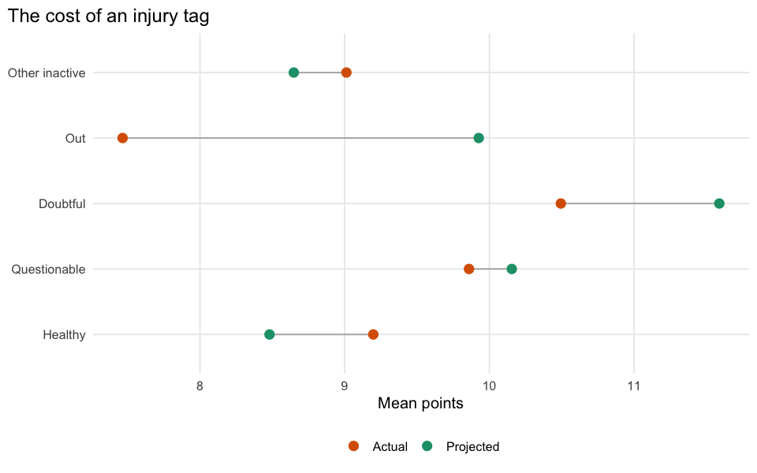

**What was found — and why the obvious reading is wrong:** at face value,
Questionable and Doubtful players are *projected higher* than Healthy
players (about 1.2-1.4x), which looks backwards. It isn't evidence that
injuries are ignored — it's a selection-bias artifact. "Healthy" in this
data means "no injury note was ever logged," which includes every
irrelevant bench and waiver-wire player who was never notable enough to
get tagged in the first place, dragging that group's average down. The
players who *do* get an injury designation are disproportionately the
notable, heavily-used players a team actually depends on. A fair test would
compare each player's own healthy-week average to their own questionable-
week average — this analysis doesn't do that harder comparison, and says
so plainly rather than reporting a misleading headline number as fact.

**What this means for how you play:** don't take a raw "Questionable
players score X% of Healthy players" statistic at face value from any
source, including this one — check whether it's comparing the same
players to themselves, or comparing different populations that happen to
share a label.

*Full detail: [06-injury-economics](06-injury-economics.md).*

## Part V — The shape of the game: positions and scarcity

**The question:** has wide receiver production overtaken running back the
way "Zero RB" drafting theory claims? And which position actually creates
the most competitive advantage per roster spot?

**The method:** track average points per position per season for the
trend question; for scarcity, rank every player at a position by season
points and plot how fast production falls off after the top spots — a
steep early drop means that position is scarce (hard to replace), a long
flat tail means it's deep (easy to replace).

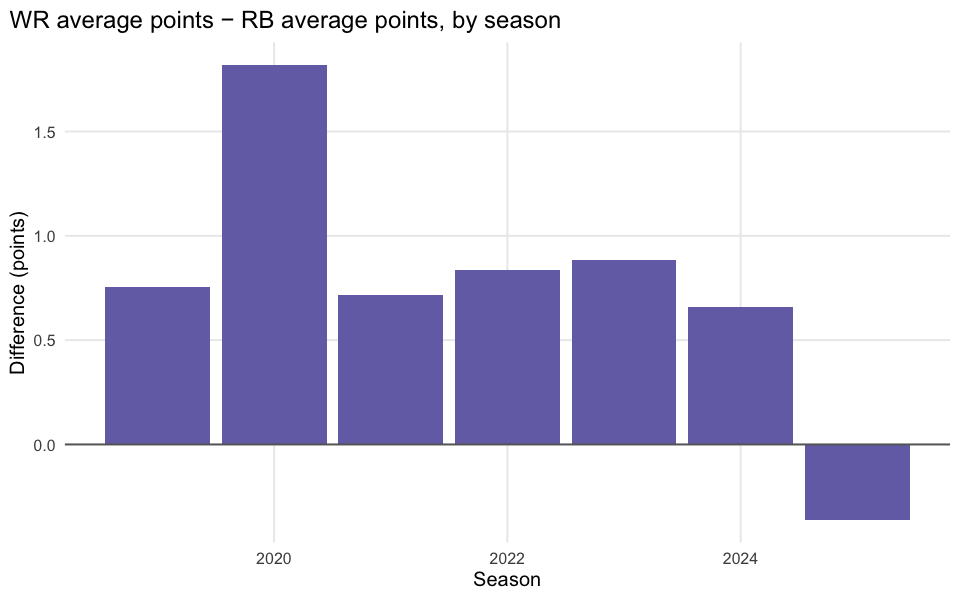

**What was found:** the WR-minus-RB gap is positive in 4 of the 6 seasons
in this data, but it isn't a clean, monotonic trend — there's a dip below
zero around 2022 and again in the most recent season. That's modest,
inconsistent support for "Zero RB" in this league, not a clear
confirmation of a structural shift. The classic scarcity intuition holds up
better: running back production drops off noticeably faster in the first
~20 ranks than wide receiver does, while WR stays relatively valuable even
near its (deeper) replacement level.

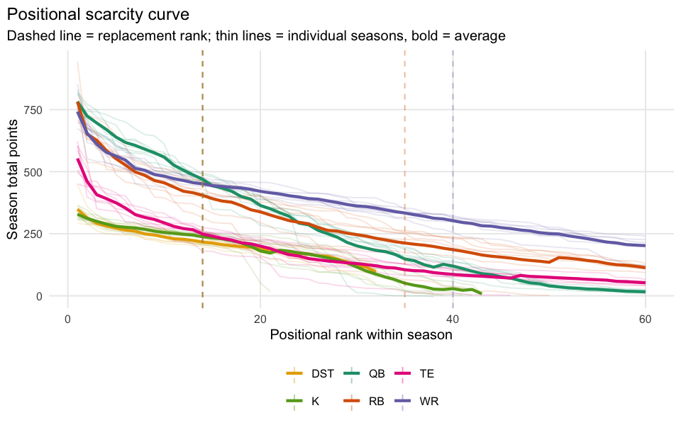

A separate clustering analysis groups player-seasons into archetypes by
production, volatility and games played — mechanically the same "reliable
star vs. boom-bust vs. bench lottery" split from Part II, but now applied
across the whole player pool at once rather than one player at a time.

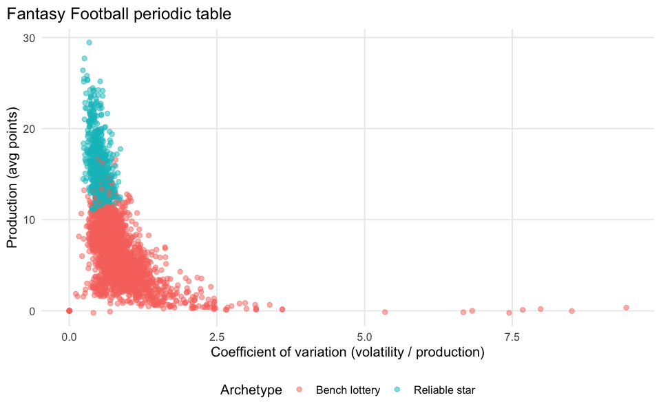

**What this means for how you play:** RB scarcity is a real, data-backed
reason to prioritize the position early in a draft; the WR-over-RB scoring
trend is real but not strong enough to be treated as a settled structural
shift in this league.

*Full detail: [08-positional-evolution](08-positional-evolution.md),
[09-value-over-replacement](09-value-over-replacement.md),
[13-periodic-table](13-periodic-table.md).*

## Part VI — Luck, manager skill, and whether the simulations can be trusted

**The question:** three separate questions belong together here, because
they're all about how much of an outcome is signal versus noise: was a
team's record mostly deserved, are some managers consistently better at
setting a lineup, and can the league's own Monte Carlo simulations be
trusted for decisions?

**The method (schedule luck, 2023-2025 only — see the coverage note
above):** compute each team's "all-play" record — how many of the *other*
teams they'd have beaten with that same weekly score — and compare it to
their actual win total. A team well above the diagonal below won more than
its scores deserved.

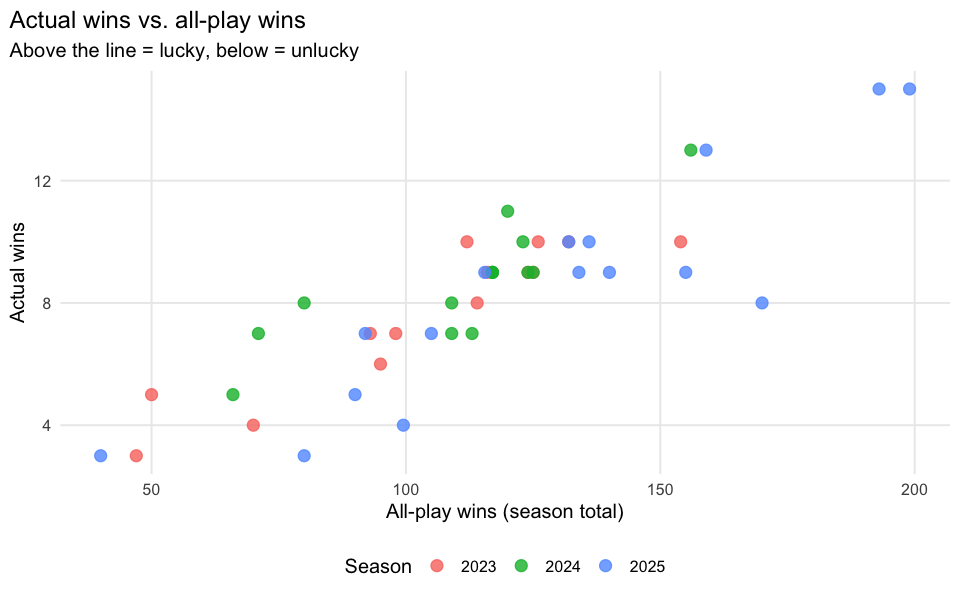

**What was found:** the two track each other reasonably well overall, but
several teams sit clearly off the diagonal in a given season — real
schedule luck, not just noise, and a legitimate reason a team's record can
overstate or understate its actual roster strength.

**The method (manager effect):** for each team-week, compare the points
their actual starters scored to the points their best-possible lineup (by
raw score, ignoring position eligibility) would have scored.

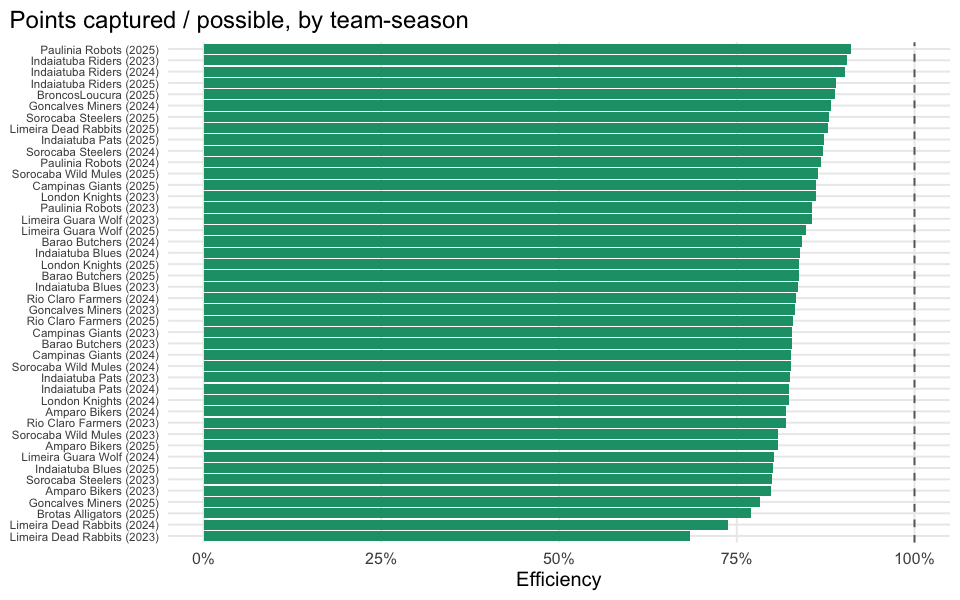

**What was found:** lineup-setting efficiency varies meaningfully across
managers — some consistently start close to their best possible lineup,
others leave real points on the bench. Treat the exact percentage as
approximate (the underlying data can't perfectly reconstruct which bench
player was truly position-eligible for which slot), but the *relative*
ranking across managers is informative.

**The method (simulation calibration):** the league's Monte Carlo
simulations produce a predictive range for each player (5th to 95th
percentile, etc.). If well-calibrated, the real result should land inside
the stated range about as often as promised — inside the 90% range about
90% of the time, and so on.

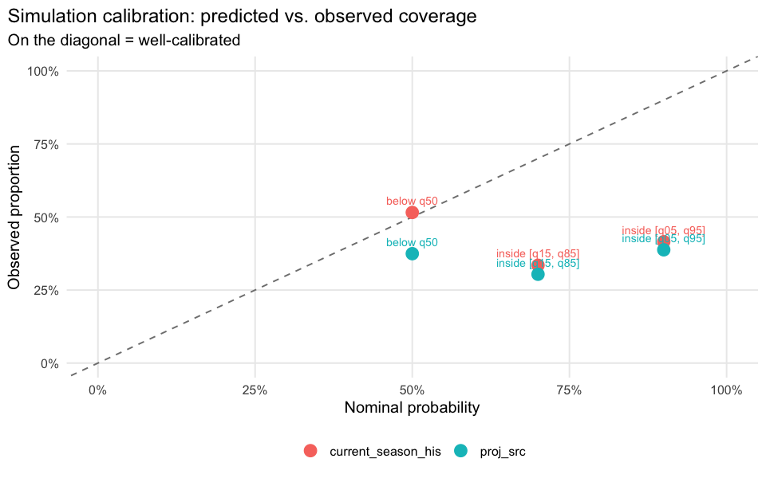

**What was found — an important caution:** both simulation methods tested
sit clearly *below* the diagonal at every interval checked — for example,
a nominal 90% range only actually contained the real result 39-42% of the
time. That means the simulations are **overconfident**: their predictive
ranges are too narrow for how variable real outcomes actually are. That's
the riskier direction to be wrong in for anyone making decisions off these
quantiles, and it's a caveat that matters again in Part VIII, where a
later analysis leans on this same simulation data.

**What this means for how you play:** don't fully credit or blame a
manager's record on skill alone — check the all-play numbers first. Do
treat manager-to-manager lineup efficiency differences as real. And treat
this league's simulation ranges as a rough guide, wider in reality than
they claim to be, not a precise probability engine.

*Full detail: [10-schedule-luck](10-schedule-luck.md),
[11-manager-effect](11-manager-effect.md),
[12-simulation-calibration](12-simulation-calibration.md).*

## Part VII — Career arcs

A more visual, qualitative closer before the big experiment: a weekly
"fingerprint" of the league's top all-time scorers, color intensity is
points, gaps are byes, injuries or unplayed seasons.

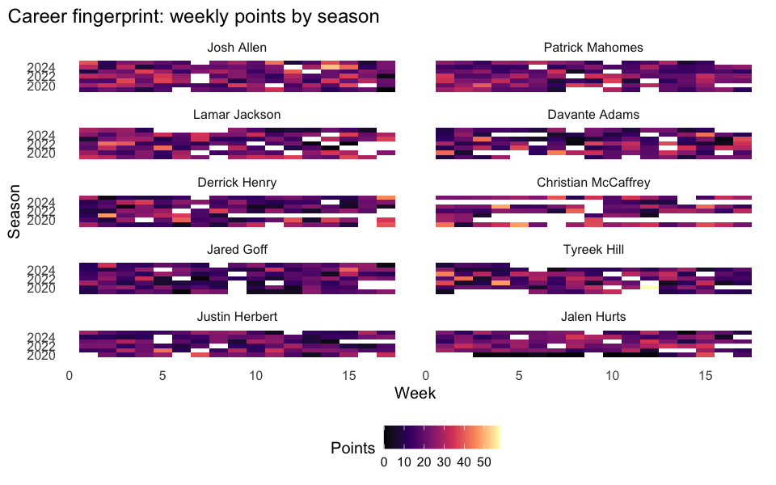

A consistently bright row is a durable, healthy star. A row with a dark
gap mid-career marks an injury or decline that's easy to miss in a
season-average stat line but obvious once you can see every week at once.

*Full detail: [14-career-fingerprint](14-career-fingerprint.md).*

---

## Part VIII — The big experiment: does win-probability beat points?

Everything above analyzes production and projection accuracy in points.
This section tests a specific, more ambitious idea directly, end to end,
against this league's real history: **should you rank players by how much
they shift your team's probability of winning, instead of by raw
projected points?**

This idea — "Fantasy Game Wins" (FGW) — comes from outside this project
(see `fgw_analysis.md` for the original brief). The core intuition is
reasonable: a player's value isn't just the points they score, it's how
much those points move your team from "probably losing" to "probably
winning." Ten points from a player who was already blowing out their
opponent matters less than ten points that flip a coin-flip game. The
question this section answers is whether that intuition, once actually
built and tested against real results, changes any real decision.

**A coverage note specific to this section:** the building blocks needed
here — a team's real weekly score, who actually started at each position,
and (for the last report) Monte Carlo simulations — only exist together
for 2023-2025, and simulation coverage within that window is thinner
still. Every report in this section is scoped to what the data actually
supports, stated explicitly rather than stretched.

### Building three versions of the metric

Three variants were built and compared against real season outcomes:

- **FGW-classic** reproduces the original method: a statistical
  approximation converts a player's points above their position's
  replacement level into an estimated win-probability shift.
- **eFGW** replaces that approximation with this league's own real history
  — an empirical curve built directly from actual team scores and actual
  wins/losses, instead of an assumed statistical shape.

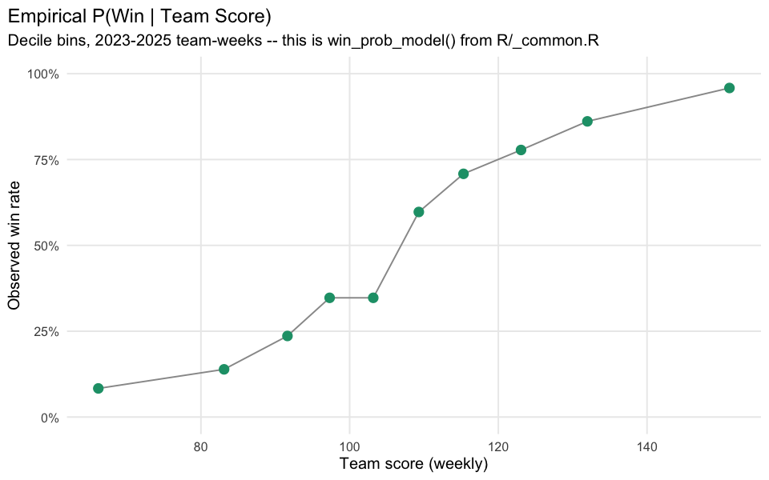

- **xFGW** is the forward-looking version: it uses *projected* points
  (not actual results) to estimate how much a player is *expected* to
  shift win probability — the form a decision tool would actually need
  before a game is played, not after.

**What was found:** raw season points already correlate strongly with real
wins — there isn't much room for any transformation of the same underlying
production to add. eFGW in particular tends to *discount* blowout
production (a huge game in a game that was never close matters less to
eFGW than to a raw point total), which is a genuinely different, arguably
more honest notion of "value" — but it also means eFGW correlates *less*
well with season win totals than plain points do. The chart below compares
playoff and non-playoff teams across all of these metrics; the separation
is real and visible for all of them, points included.

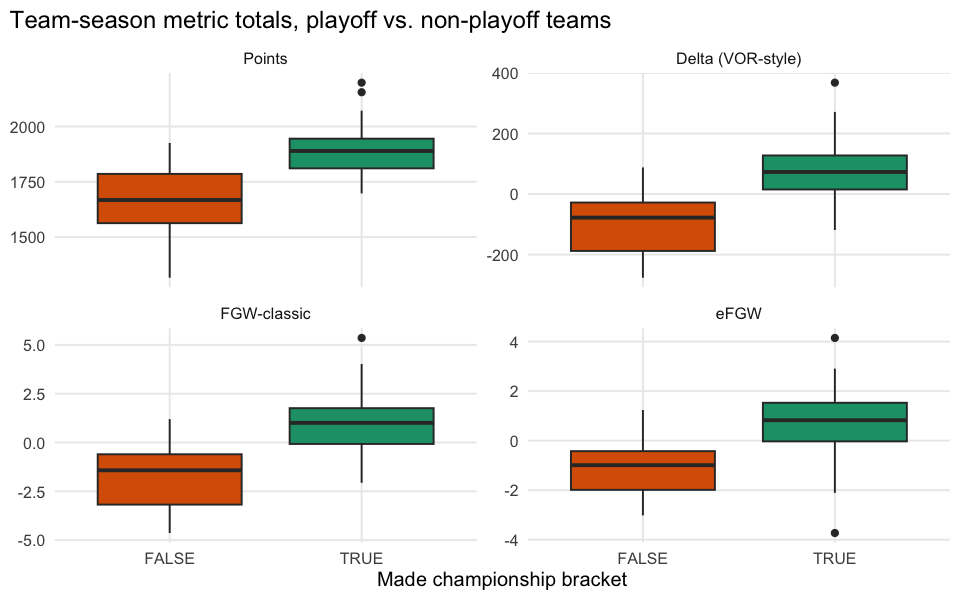

### Does it predict, not just describe?

A metric that only explains the past isn't useful for a decision you have
to make this week. Trailing FGW/eFGW (through week *N*) was tested against
trailing points-per-game and the projection itself as predictors of a
player's *next* few weeks.

**What was found:** trailing projection and trailing points-per-game both
predict a player's near-term future meaningfully better than trailing
FGW-classic or eFGW do. That's not a disappointing result — it's the
expected one. FGW is built to explain what already happened, and in doing
so it deliberately discards exactly the kind of signal (this player is
simply good, healthy, and featured) that actually carries forward week to
week. For forecasting, the plain projection remains the better tool.

### The real test: would it have won you more games?

This is the test that matters most, because everything above is either
descriptive or predictive of production — not of the actual decision a
manager makes. For every real historical start/sit decision this league
faced (a starter and the real bench players who could have replaced them
at that position), three approaches were compared: rank by points, rank by
VOR, or rank by xFGW.

**What was found:** across roughly 3,500 real decisions with an eligible
alternative, xFGW disagreed with simply starting the higher-projected
player only about **2.6% of the time** — a low "decision flip rate." Most
start/sit calls simply don't have a same-position alternative close enough
for the win-probability framing to matter in practice. And on the small
subset of decisions where xFGW *did* disagree with points, xFGW's
hypothetical win rate did not come out ahead of just starting the
higher-projected player — a small sample (under 100 decisions), but no
evidence in favor of switching. The win-probability model itself was also
checked for calibration using only information available before kickoff
(projected totals, not final scores):

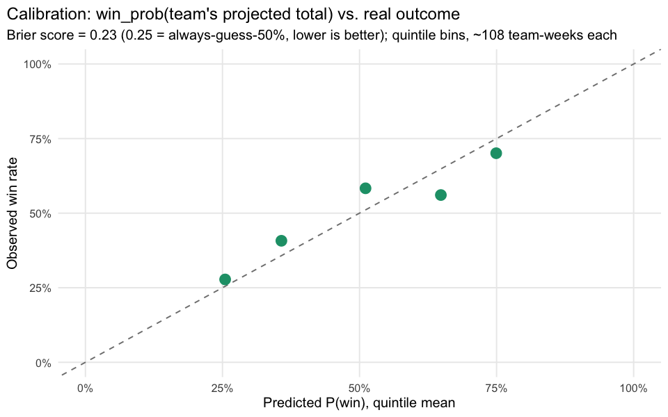

Calibration here is real but modest — clearly better than always guessing
a coin flip, but well short of a sharp forecaster. Put together, this
three-season sample gives **no evidence that xFGW would have won this
league more games than simply starting the higher-projected player
already does.**

### A narrower, illustrative case: waiver adds

A full backtest for waiver/roster decisions the way the start/sit test
above was run isn't possible — the simulation data it would need only
covers 14 season-weeks total, none of them in 2025. Instead, one real,
concrete decision was worked through end to end: a real RB2 slot, a real
bench alternative, and every other bench-eligible player in the league who
had simulation coverage for the following two weeks, ranked by simulated
win-probability lift.

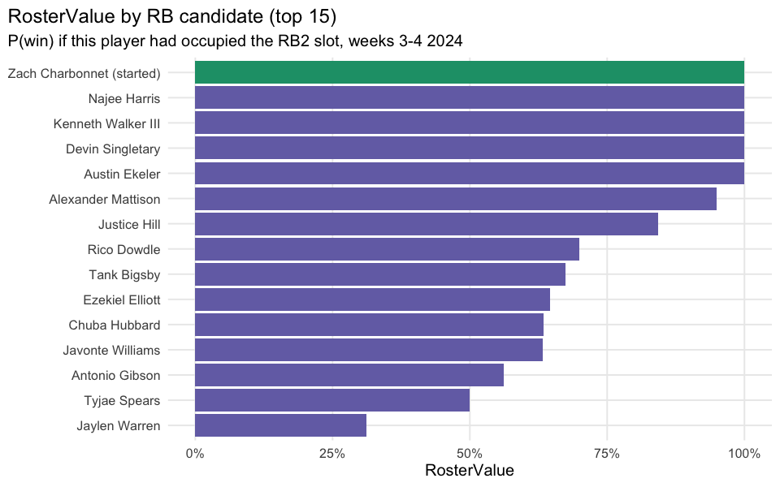

**What was found:** in this one case, the simulation-based ranking and
plain projected points agreed almost perfectly (rank correlation ≈ 0.93).
The real historical start ranked in the top tier by both methods, and the
manager's actual bench alternative ranked at the very bottom by both — the
real decision checks out, but this is one illustrative case, not a general
finding at the same confidence level as the start/sit test above.

### The honest bottom line

FGW and its variants are a genuinely different, and in some ways more
principled, way to describe *what already happened*. They are not better
at predicting what a player will do next, and — in the one rigorous,
league-scale test this data could support — there is no evidence that
ranking decisions by win-probability instead of points would have won this
league more games. That's a real, useful answer: it means the extra
complexity isn't currently worth adopting for this league's start/sit
decisions, and it's the kind of negative result a less careful analysis
would have been tempted to paper over.

*Full detail: [15-fgw-metrics](15-fgw-metrics.md),
[16-fgw-persistence](16-fgw-persistence.md),
[17-fgw-decision-backtest](17-fgw-decision-backtest.md),
[18-fgw-roster-construction](18-fgw-roster-construction.md).*

---

## Part IX — What this means for how you play

Pulling the threads above into concrete takeaways for this league:

- **Don't trust a projection source because it's the most common one.**
  The highest-volume sources in this data were not the most accurate ones.
- **Treat two same-projected players differently if one is boom-bust and
  the other is steady.** The projection number alone hides that
  distinction; several seasons of history don't.
- **Use stated projection uncertainty for relative risk, not as a literal
  betting range.** A higher `sd_pts` really does mean a noisier outcome; a
  `floor`-`ceiling` band shouldn't be read as "the real result will very
  likely land here."
- **Be skeptical of any "injury tag costs X points" claim, including ones
  in this dataset,** unless it compares players to their own healthy-week
  selves rather than to a different population entirely.
- **Draft running backs for scarcity, not for a settled "WR is now
  better" thesis.** The scarcity curve is a clean, repeated pattern; the
  WR-over-RB scoring trend is real but inconsistent season to season.
- **For start/sit decisions, plain projected points (or VOR) remain the
  right tool.** A more sophisticated win-probability transform was built
  and tested rigorously here, and it did not outperform points in this
  league's real history.
- **Treat this league's simulation ranges as directionally useful but too
  narrow.** They were shown to be overconfident, not too cautious.

## Limitations and what isn't answered here

This guide, like every report it summarizes, is only as good as its data
coverage, and that coverage isn't uniform:

- **Team scores, starter/bench rosters, and matchup outcomes** only exist,
  finalized, for **2023-2025**. Every analysis touching those (schedule
  luck, manager effect, and the entire FGW decision-backtest section) is
  scoped to that window, not the full six seasons.
- **Projection uncertainty (`sd_pts`/`floor`/`ceiling`)** spans 2020-2025
  but is thin in two seasons — 2021 has only week 1, and 2023 only 5 of 17
  weeks — so any conclusion drawn across "all six seasons" for that
  specific field is really carried by the four solid seasons.
- **Monte Carlo simulation coverage** is split into disjoint, thin eras
  (2020-2022 under one label, 2023-2024 under others) with **no coverage
  at all in 2025**, which is why the roster-construction case study in
  Part VIII is explicitly one illustrative example, not a backtest.
- **Sample sizes throughout are league-scale, not population-scale** — a
  handful of managers and a few hundred matchups per multi-season window,
  not thousands. Directional findings here are real, but exact percentages
  (a 2.6% flip rate, an 0.93 rank correlation) shouldn't be treated as
  precise to more than one significant figure.

For the full schema, table-by-table row counts, and season/week coverage
of every underlying file, see [`DATA_CATALOG.md`](../DATA_CATALOG.md) and
[`dataset/README.md`](../dataset/README.md). For the code behind any
number in this guide, every section above links to its source report.
